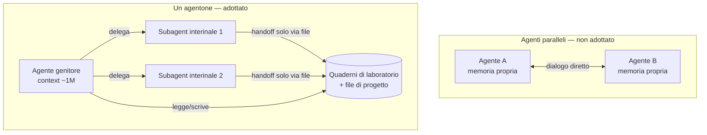
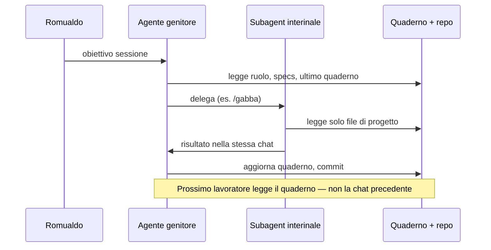

# Modello operativo: un agentone e quaderni di laboratorio

Aabacus adotta un modello deliberato, diverso dal modello ideale degli **agenti paralleli**. Questo documento fissa la distinzione e le regole di handoff.

---

## 1. Due modelli mentali

### Agenti paralleli (potenza teorica — non adottato)

Più agenti autonomi lavorano **in parallelo**, ciascuno con:

- **memoria ed esperienza personale** persistente (oltre il singolo task);
- capacità di **parlarsi direttamente** e coordinarsi senza un umano in mezzo.

È il modello che massimizza la potenza del “team AI” quando la piattaforma lo supporta pienamente. Oggi in Cursor, aprire chat separate (es. css-specialist in una tab e Gabba in un’altra) **non** realizza questo modello: non c’è memoria condivisa tra chat e Romualdo diventa hub manuale.

### Un agentone (modello adottato Aabacus)

**Un solo agente genitore** per sessione di lavoro, con context window grande (fino a ~1M token), che:

1. **assume continuamente subagent interinali** (Gabba, explore, ecc.) per compiti delimitati;
2. mantiene la **continuità narrativa** della sessione nel proprio context;
3. delega ai subagent che **capiscono cosa fare esclusivamente dai file del progetto** — non da memoria personale esterna.

I subagent sono **lavoratori temporanei**: quando la delega termina, non resta una “esperienza Gabba” separata da riaprire in un’altra chat. L’unica memoria durevole è ciò che viene **scritto nel repo**.

---

## 2. Dove vive la memoria

| Tipo di memoria | Esiste in Aabacus? | Dove |
|-----------------|-------------------|------|
| Esperienza personale del subagent tra sessioni | **No** | — |
| Cronologia chat del genitore (stessa sessione) | Sì, temporanea | UI Cursor |
| Ruoli, perimetri, istruzioni operative | Sì | `AGENTS.md`, `project/Organization/roles/`, `.cursor/agents/` |
| Contratto architetturale | Sì | `project/specs/` |
| Stato di lavoro e decisioni | Sì | **quaderni di laboratorio**, commit, PR |
| Codice e test | Sì | repo git |

**Regola:** il subagent che entra **non** deve dipendere da “quello che ricordo dell’ultima volta in un’altra chat”. Deve poter ricostruire tutto leggendo i file indicati nel quaderno e nelle specs.

---

## 3. Handoff tra lavoratori interinali

Quando un subagent finisce (o quando si passa a un altro ruolo nella stessa sessione), lo stato passa al successivo **solo** attraverso:

1. **Quaderno di laboratorio** — vedi [`quaderni/_template.md`](quaderni/_template.md);
2. **Altri documenti di progetto** — specs, organigramma, schede ruolo;
3. **Artefatti git** — branch, commit, diff, PR;
4. **Suite di test** — risultati in `project/tests/`, log CI.

Non attraverso: copia-incolla di risposte tra chat, note private fuori repo, “memoria” implicita di un agente in un’altra finestra.

---

## 4. Implicazioni pratiche

| Situazione | Comportamento corretto |
|------------|------------------------|
| Gate test dopo refactor CSS | Genitore delega `/gabba` **nella stessa sessione**; Gabba legge `project/tests/` e `project/specs/tests.md` |
| Fine sessione / cambio agente | Aggiornare quaderno con stato, decisioni, prossimi passi |
| Cloud Agent vs locale AISandbox | Stesso modello: memoria durevole = repo; la chat cloud non “ricorda” la chat locale |
| Due Architecture Expert sullo stesso passo | Evitare — un solo genitore per filone di lavoro |
| Romualdo come collo di bottiglia | Ridotto: handoff via quaderno, non via incolla risposte |

---

## 5. Relazione con l’organigramma

- **Livelli L1–L4** (`organigramma.md`): chi decide cosa e in quale perimetro.
- **Agenti in `.cursor/agents/`**: profili operativi che il genitore può assumere o delegare.
- **Questo documento**: *come* quelle istanze collaborano senza memoria personale tra sessioni.

Vedi anche: [organigramma.md §3](organigramma.md#3-come-collaborano--due-modelli-scegliere-quello-giusto) per il confronto operativo Cursor (subagent vs chat parallele).
