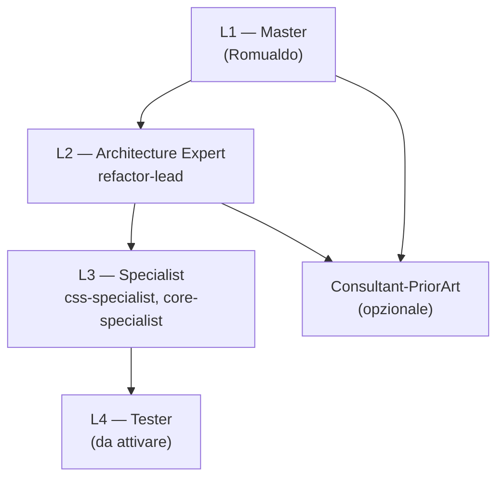
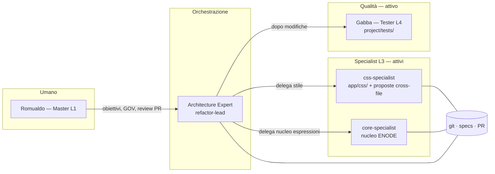
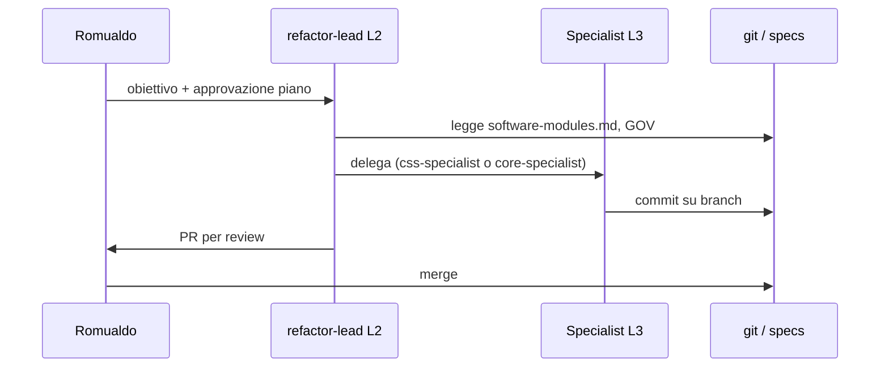

# Organigramma agenti Aabacus

Romualdo coordina il team AI attraverso ruoli a livelli (`AGENTS.md`). Gli agenti Cursor in `.cursor/agents/` implementano i ruoli Specialist attualmente attivi.

---

## 1. Piramide dei livelli

| Livello | Chi | Modifica codice? | Approvazione Romualdo |
|---------|-----|------------------|------------------------|
| L1 | Romualdo (Master) | specs livello 1 | — |
| L2 | Architecture Expert | sì, multi-modulo | **sempre** prima di refactor trasversali |
| L3 | Specialist | sì, perimetro ristretto | no, se resta nel confine |
| L4 | Tester | solo `project/tests/` | no |
| — | Consultant-PriorArt | no (solo docs) | no |

---

## 2. Organigramma operativo

Solo i ruoli rilevanti **oggi**. Altri Specialist si aggiungeranno quando servirà.

---

## 3. Come collaborano — modello adottato: un agentone

Definizione completa: [`modello-agentone.md`](modello-agentone.md).

In sintesi: **un agente genitore** per sessione (context fino a ~1M token) assume **subagent interinali** che capiscono il lavoro **solo dai file del progetto**. Non c’è memoria personale tra sessioni: l’unica memoria durevole sono **quaderni di laboratorio**, specs e git.

| Modello | Adottato? | Memoria | Handoff |
|---------|-----------|---------|---------|
| **Agenti paralleli** — più agenti autonomi che si parlano, ciascuno con esperienza propria | No (ideale teorico) | personale per agente | dialogo diretto agente↔agente |
| **Un agentone** — genitore + subagent temporanei | **Sì** | solo file di progetto | quaderni + commit + stessa chat genitore |

### ❌ Anti-pattern: chat parallele come “agenti paralleli”

Aprire **css-specialist** in una tab e **Gabba** in un’altra simula gli agenti paralleli ma **non** li realizza: nessuna memoria condivisa, Romualdo deve **copiare ogni risposta** a mano.

### ✅ Pattern corretto: subagent nella **stessa sessione** del genitore

Il genitore (es. css-specialist) **delega** a Gabba; Gabba lavora in contesto isolato e **restituisce il risultato al genitore** nella stessa chat. Lo stato che deve sopravvivere alla chiusura della sessione va nel **quaderno di laboratorio** ([`quaderni/`](quaderni/)).

| Meccanismo | Uso |
|------------|-----|
| **Subagent** (`.cursor/agents/gabba.md`) | css-specialist invoca `/gabba` o “delega a Gabba” → gate test automatico |
| **Repo Git** | codice, branch, PR, review |
| **`project/specs/`** | contratto architetturale e regole |
| **`AGENTS.md` + `Organization/roles/`** | ruoli e perimetri |
| **CI su PR** (futuro) | smoke/playwright su ogni push senza umano in loop |
| **`project/Organization/quaderni/`** | memoria durevole tra sessioni e tra lavoratori interinali |
| **Handoff locale ↔ cloud** | stesso repo + quaderno; la chat non è memoria condivisa |

Gabba **è già definito** in `.cursor/agents/gabba.md` — non serve un secondo Cloud Agent creato da zero; serve **invocarlo come subagent** dal genitore.

**Requisiti Cursor** (vedi [Subagents](https://cursor.com/docs/subagents)): modello **non Auto** se il tool Task non è disponibile; subagent in **foreground** per attendere PASS/FAIL prima dello step successivo.

### Regole pratiche

1. **Un capo per sessione refactor** (L2): evita due Architecture Expert sullo stesso passo del piano.
2. **Specialist nel perimetro**: css-specialist **modifica liberamente** `app/css/` e **legge** JS/HTML per accoppiamenti; core-specialist non tocca CSS salvo coordinamento.
3. **Cross-cutting** (rename classi ↔ JS, refactor architetturale): css-specialist **propone** in tabella *Proposte cross-file*; implementa fix minimali solo se strettamente necessari per il task CSS corrente; refactor-lead coordina il resto.
4. **Gabba (Tester L4)** — gate smoke + Playwright; in evoluzione regression visiva per step CSS ad alto rischio.

---

## 4. Profili Mac

| Profilo | Uso tipico | Ambiente agenti |
|---------|------------|-----------------|
| **romualdogrillo** | Master, review, visione, MCP GDrive sensibile | locale (+ cloud per task lunghi) |
| **AISandbox** | Specialist, refactor, test | **locale** (repo clonato e cartella aperta) |

Su AISandbox aprire sempre la **cartella locale** del clone; altrimenti Cursor offre solo Cloud.

---

## 5. Roadmap agenti (non ancora creati)

| Ruolo | Agente previsto | Quando |
|-------|-----------------|--------|
| Architecture Expert | `refactor-lead.md` | prossimo passo orchestrazione |
| ~~Tester~~ | **Gabba** (`gabba.md`) | **attivo** — gate + espansione suite |
| Altri Specialist | rendering, properties, interaction, … | solo se necessario |

---

## 6. Diagrammi stampabili

PDF generati da `diagrams/*.mmd`:

- [`diagrams/organigramma-operativo.pdf`](diagrams/organigramma-operativo.pdf)
- [`diagrams/organigramma-livelli.pdf`](diagrams/organigramma-livelli.pdf)

Rigenerazione: `bash project/Organization/scripts/render-diagrams.sh`
