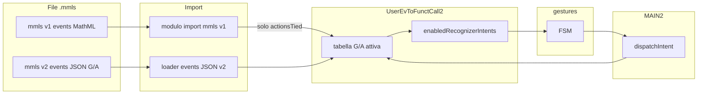

!!!GOV level:2architecture requiredApprovalFrom:Romualdo

# Tabella G/A (Gesture/Actions) — contratto architetturale

**Fase: v1f** — etichette: [`release-phases.md`](release-phases.md).  
Documento di **livello 2**: fissa struttura, significato e interazione tra moduli per la **tabella G/A** (gesture/actions, colonne tied/untied) della pista `index2`. Non va modificato senza approvazione esplicita di Romualdo.

Documenti correlati: [`session-lifecycle.md`](session-lifecycle.md) (BOOT/PRELOAD/LOAD/SAVE), [`new-interface-spec.md`](new-interface-spec.md) §7 (requisiti UI), [`software-modules.md`](software-modules.md) (strati).  
Prototipo file **mmls formato-events v2** (JSON G/A in `events`): `app/Data/exercises/prop_comm_gen_mmlsv2.mmls`.  
*(Il nome “mmls v2” qui è il formato della sezione events, non la fase prodotto **v2**.)*

---

## 1. Ruolo della tabella G/A

La **tabella G/A** è il formato corretto e l’**unico punto** in cui scrivere ogni associazione tra gesture (o alias tastiera) e actions, con le due colonne `actionsUntied` / `actionsTied`.

Eccezioni ammesse solo con motivo preciso, ad esempio:

- fallback quando il preload non è disponibile e l’utente deve caricare un file a mano (scorciatoie di sessione già in tabella, es. Shift+L);
- comportamenti ancora cablati nel codice legacy/index2 da migrare (es. azioni legate al **doppio click** in `MAIN.js` / stub mancanti in `MAIN2`) — debito da riportare progressivamente nella G/A o in un omologo esplicito.

| Modulo | Ruolo |
|--------|--------|
| `UserEvToFunctCall2.js` | **Unico custode** runtime della tabella G/A (default, `getTable`/`setTable`, resolve, API pure) |
| `gestures.js` | Recognizer puro: ascolta solo i trigger con try-list non vuota nella **colonna attiva** |
| `MAIN2.js` | Orchestrazione: carica G/A, sync recognizer, dispatch, toggle tied |
| Import **mmls v1** (`app/js/input2/importMmlsV1.js`) | Adattatore legacy → scrive/sovrascrive solo la colonna **tied** dopo load backend |
| File **mmls v2** | Sezione `events` = JSON della tabella G/A |

`MAIN2` e `gestures` **non** possiedono la tabella; non si inventano mappe parallele (`intentMap`, ecc.).

---

## 2. Struttura di una riga G/A

```text
{
  trigger: string|null,     // nome gesto recognizer, es. 'tap'|'lasso'|'dnd'|'slashHor'|…
  alias: string|null,       // scorciatoia tastiera, es. 'Mod+z'|'p'|'ArrowRight'|…
  targetSource: string|null,// 'selected'|'pinched'|'slashed'|null
  actionsUntied: Action[],  // try-list se GLBsettings.tiedCanvas === false
  actionsTied: Action[],    // try-list se GLBsettings.tiedCanvas === true
  system: boolean           // true → vincoli di rimappatura (vedi §8)
}
```

`Action` = `string` (solo nome) oppure `{ name: string, val?: string }` (es. `plusAssociate` + `rtl`).

Vincoli:

1. Ogni riga ha almeno un discriminante tra `trigger` e `alias` (non entrambi null in produzione).
2. Le due colonne esistono sempre (possono essere liste vuote).
3. Lista vuota per lo stato tied/untied **corrente** → recognizer **non ascolta** quel `trigger`.
4. `system: true` → non sovrascrivibile in modo arbitrario da import v1 senza policy esplicita (warning).

### 2.1 Azioni chiuse vs canale aperto

| Tipo | Cosa c’è nella try-list | Chi sceglie la proprietà |
|------|-------------------------|---------------------------|
| **Chiusa** | Nome proprietà (es. `plusAssociate`) | Il record G/A; l’utente indica solo l’operando (es. `.selected`) |
| **Canale aperto** (builtin) | Solo il gate (es. `applyDnD`) | Runtime: drag source/target, `ci[data-tag]` in canvas, registry HW, … |

La G/A **non** elenca `replaceDnD` / `associativeDnD` / …: quelle restano nel registro proprietà + presenza in canvas. La riga aperta dice solo *se* il canale è disponibile nella colonna tied/untied.

---

## 3. Canale aperto: DnD (minimo v1f)

Record system di riferimento (`DEFAULT_TABLE`):

```text
{
  trigger: 'dnd',
  alias: null,
  targetSource: null,          // source/target arrivano dall’intent recognizer
  actionsUntied: ['applyDnD'],
  actionsTied: ['applyDnD'],
  system: true
}
```

| Campo | Ruolo |
|-------|--------|
| `trigger: 'dnd'` | Gesto drag→drop del recognizer (`gestures.js`) |
| `applyDnD` | Builtin in `MAIN2`: first-wins su `getDnDpropEnabled` / `findTgt` → `property.apply` |
| Liste non vuote | Abilita l’ascolto `dnd` in quella colonna; liste vuote ⇒ DnD off (come gli altri trigger) |

**Non** in questa riga: autoAdapt / copy / declare come tool separati; commutativa-via-sort (Sortable, fuori registry).  
*(Futuro / altro passo: riga aperta `confirmApply` + Enter → `applySelectedTool`.)*

Allineamento inventario UI: B1 in [`new-interface-spec.md`](new-interface-spec.md); B3 autoAdapt = debito/ramo interno, non seconda riga G/A per ora.

---

## 4. Ascolto per colonna (tied / untied)

L’ascolto si decide **leggendo l’intera riga** e la colonna dello stato corrente (`GLBsettings.tiedCanvas`).

| Situazione | Significato |
|------------|-------------|
| Riga assente | Non ascoltare |
| Riga presente, lista della colonna attiva **vuota** | **Non** ascoltare in quello stato |
| Riga presente, lista della colonna attiva **non vuota** | Ascoltare + dispatch (availability sulle azioni didattiche) |

Esempio: `lasso` con `actionsUntied: []` e `actionsTied: [plusAssociate rtl]` → ascolto solo a canvas **tied**.  
Il toggle lucchetto ricalcola i flag di ascolto (non ricarica il file).

---

## 5. Persistenza: mmls v1 vs mmls v2

### 5.1 mmls versione 1 (legacy)

- Sezione `events`: MathML/`eventtoaction` (es. import `gestToAction.mml`), **senza** distinzione tied/untied.
- Semantica storica: descrive lo stato **tied** (didattica vincolata).
- **Import**: un modulo dedicato (unico responsabile dell’adattamento legacy) legge quel formato e **sovrascrive implicitamente la colonna `actionsTied`** della tabella G/A (a partire dal default o dalla G/A già caricata, secondo la policy del modulo).
- Non è il formato di scrittura preferito per i nuovi esercizi.

### 5.2 mmls versione 2

- `settings.mmlsVersion`: `2`.
- Sezione `events`: **JSON** che descrive la tabella G/A, non MathML `eventtoaction`.

Forma di riferimento (prototipo `prop_comm_gen_mmlsv2.mmls`):

```text
{
  "format": "gestureActionTable",
  "formatVersion": 2,
  "rows": [ /* righe G/A come in §2 */ ]
}
```

- In v2 la sezione `events` è la **fonte file** della G/A per l’esercizio (caricata nel custode via `setTable` / merge definito dal loader).
- Save/load futuri devono serializzare la G/A in questo JSON, non ricostruire `eventtoaction` v1 salvo export esplicito di compatibilità.

### 5.3 Rilevazione versione

- `settings.mmlsVersion === 2` (e/o `events.format === "gestureActionTable"`) → percorso v2.
- Assenza / v1 → percorso import legacy (modulo v1 → colonna tied).

---

## 6. Vocabolario dei `trigger`

| Intent recognizer (`type` [+ `axis`]) | `trigger` in G/A |
|---------------------------------------|------------------|
| `tap` | `tap` |
| `lasso` | `lasso` |
| `dnd` | `dnd` |
| `slice` + `h` / `v` | `slashHor` / `slashVert` |
| `pinch` (+ `axis` h/v ancora emesso) | `pinch` (**v1f interim**: H/V fusi; axis ignorato in resolve) |

*(Futuro: ridiscriminare `pinchHor`/`pinchVert` e/o determinare meglio gli operandi.)*  
`alias` può essere stringa o array (es. `['ArrowDown','ArrowLeft']` sulla riga `pinch`).

Gli `alias` tastiera abilitano la via tastiera; l’ascolto pointer dipende dal `trigger` e dalla colonna attiva.

---

## 7. Flusso tra moduli (target)



1. Preload / load file → v1 o v2 → aggiornamento G/A nel custode.
2. `enabledRecognizerIntents(table, { tied })` → `gestures.setEnabledIntents`.
3. Toggle tied → sync ascolto (senza rileggere il file).
4. `setTable` (console/API) → G/A + sync + pannello debug (Shift+D).

---

## 8. Regole immutabili (non cambiare senza Romualdo)

1. Un solo custode runtime della G/A: `UserEvToFunctCall2.js`.
2. **Niente associazioni gesture↔action fuori dalla G/A**, salvo eccezioni documentate (§1).
3. Ascolto gated dalla colonna attiva (lista vuota ⇒ non ascoltare).
4. Discriminante colonna: `GLBsettings.tiedCanvas`.
5. **mmls v1** → solo import dedicata → colonna **tied**; **mmls v2** → JSON G/A in `events`.
6. Azioni didattiche: `TryOnePropertyByName` / availability; builtin (`undo`, `toggleSelect`, `selectSiblings`, `applyDnD`, …) no.
7. Nuovi trigger o cambio semantica colonne / formato file → aggiornare **questo** documento + approvazione Romualdo.

---

## 9. API di riferimento (contratto)

Custode (`UserEvToFunctCall2.js`):

- `DEFAULT_TABLE`, `getTable` / `setTable` (accetta anche JSON string dell’array righe)
- `resolveIntent(intent, table, { tied })`
- `listActiveGestureTriggers` / `enabledRecognizerIntents(table, { tied })`
- `applyMmlsOverrides` — bridge verso override riga; l’import v1 dedicato lo userà per la sola colonna tied

Recognizer (`gestures.js`): `bindGestureRecognizer`, `setEnabledIntents`.

Da implementare: modulo **import mmls v1**; reader **events JSON v2** in catena preload/`MAIN2`.

---

## 10. Allineamento codice / debito

| Stato | Note |
|-------|------|
| Runtime G/A + ascolto per colonna | `UserEvToFunctCall2.js`, `gestures.js`, `MAIN2.js` |
| Canale aperto DnD (`applyDnD`) | Riga system in `DEFAULT_TABLE`; dispatch in `MAIN2.applyDnD` — §3 |
| Prototipo mmls v2 | `app/Data/exercises/prop_comm_gen_mmlsv2.mmls` |
| Import v1 dedicato | `importMmlsV1.js` — usato da `MAIN2.reloadMmlsOverrides` dopo preload/Shift+L (SaveLoad) |
| Reader events JSON v2 | Parziale in `MAIN2.tryLoadMmlsV2GA` (prototipo); da irrigidire |
| Doppio click → azioni | ancora nel codice (`MAIN.js`); fuori G/A — da migrare o documentare come eccezione |
| confirmApply / Enter → selectedTool | *futuribile* (altro passo del piano canali aperti) |
