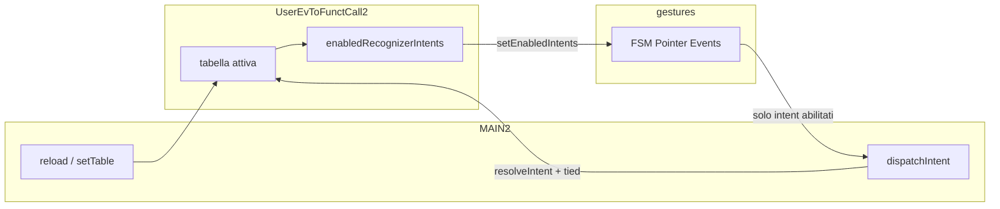

!!!GOV level:2architecture requiredApprovalFrom:Romualdo

# Tabella Gesture/Actions (FrontEnd2) — contratto architetturale

Documento di **livello 2**: fissa struttura, significato e interazione tra moduli per la tabella gesture/tasto → azioni della pista `index2`. Non va modificato senza approvazione esplicita di Romualdo.

Documenti correlati: [`new-interface-spec.md`](new-interface-spec.md) §7 (requisiti UI), [`software-modules.md`](software-modules.md) (strati).

---

## 1. Ruolo

La tabella è il **contratto** tra:

| Modulo | Ruolo rispetto alla tabella |
|--------|-----------------------------|
| `UserEvToFunctCall2.js` | **Unico custode**: formato riga, tabella di default, resolve, override `.mmls`, API pure |
| `gestures.js` | Recognizer puro: emette *intent*; **ascolta solo** le famiglie di gesto i cui `trigger` compaiono nella tabella attiva |
| `MAIN2.js` | Orchestrazione (omologo di `MAIN.js`): carica/aggiorna la tabella attiva, passa al recognizer l’insieme abilitato, dispatch → azioni |
| Sezione `#events` del `.mmls` | Override didattici (non system) su righe esistenti |

`MAIN2` **non** possiede la tabella; `gestures` **non** conosce proprietà matematiche né colonne tied/untied.

---

## 2. Struttura di una riga

```text
{
  trigger: string|null,     // nome gesto recognizer, es. 'tap'|'lasso'|'dnd'|'slashHor'|…
  alias: string|null,       // scorciatoia tastiera, es. 'Mod+z'|'p'|'ArrowRight'|…
  targetSource: string|null,// 'selected'|'pinched'|'slashed'|null
  actionsUntied: Action[],  // try-list se GLBsettings.tiedCanvas === false
  actionsTied: Action[],    // try-list se GLBsettings.tiedCanvas === true
  system: boolean           // true → non riconfigurabile da .mmls
}
```

`Action` = `string` (solo nome) oppure `{ name: string, val?: string }` (es. `plusAssociate` + `rtl`).

Vincoli:

1. Ogni riga ha almeno un discriminante tra `trigger` e `alias` (non entrambi null in produzione).
2. Le due colonne `actionsUntied` / `actionsTied` esistono sempre (possono essere liste vuote).
3. Lista vuota per lo stato tied/untied **corrente** → recognizer **non ascolta** quel `trigger` (e il dispatch non riceve l’intent).
4. `system: true` → override `.mmls` ignorato (warning); non rimuove la riga.

---

## 3. Significato: ascolto per colonna (tied / untied)

L’ascolto del recognizer si decide **leggendo l’intera riga** e scegliendo la colonna dello stato corrente (`GLBsettings.tiedCanvas`).

| Situazione | Significato |
|------------|-------------|
| **Riga assente** (nessuna riga con quel `trigger`) | Non ascoltare |
| **Riga presente, lista della colonna attiva vuota** (`actionsUntied` se untied, `actionsTied` se tied) | **Non ascoltare** quella gesture in quello stato |
| **Riga presente, lista della colonna attiva non vuota** | Ascoltare + dispatch della try-list (filtrata da availability per le azioni didattiche) |

Esempio: riga `lasso` con `actionsUntied: []` e `actionsTied: [plusAssociate rtl]`:
- canvas **untied** → il recognizer **non** traccia il lazo;
- canvas **tied** → il recognizer ascolta il lazo e prova `plusAssociate`.

Il toggle tied/untied (lucchetto) deve ricalcolare i flag di ascolto.

---

## 4. Vocabolario dei `trigger` (intent ↔ riga)

| Intent recognizer (`type` [+ `axis`]) | `trigger` in tabella |
|---------------------------------------|----------------------|
| `tap` | `tap` |
| `lasso` | `lasso` |
| `dnd` | `dnd` |
| `slice` + `axis:'h'` | `slashHor` |
| `slice` + `axis:'v'` | `slashVert` |
| `pinch` + `axis:'h'` | `pinchHor` |
| `pinch` + `axis:'v'` | `pinchVert` |

Gli `alias` tastiera (es. `ArrowRight` → stessa riga di `slashVert`) non abilitano da soli l’ascolto pointer del gesto omologo: l’ascolto pointer dipende dal campo `trigger`. L’alias abilita solo la via tastiera.

---

## 5. Flusso tra moduli



1. Boot / post-preload / cambio `#events`: `MAIN2` ricostruisce la tabella attiva (`DEFAULT_TABLE` + override `.mmls`).
2. Da quella tabella deriva `enabledRecognizerIntents` e lo passa a `gestures.setEnabledIntents`.
3. Il recognizer ignora le famiglie disabilitate.
4. Intent emessi → `dispatchIntent` → `resolveIntent(…, { tied })` → try-list della colonna corrente.

---

## 6. Regole immutabili (non cambiare senza Romualdo)

1. Un solo custode della tabella: `UserEvToFunctCall2.js`.
2. **Ascolto gated dalla colonna attiva**: niente ascolto se la riga manca **oppure** se la try-list della colonna tied/untied corrente è vuota.
3. Colonne tied/untied: discriminante runtime `GLBsettings.tiedCanvas`.
4. Righe `system` non rimappabili da `.mmls`.
5. Azioni didattiche passano da `TryOnePropertyByName` / registry (availability); i builtin (`undo`, `toggleSelect`, `selectSiblings`, `applyDnD`, …) no.
6. Nomi nuovi di gesto o cambio semantica delle colonne richiedono aggiornamento di **questo** documento e approvazione Romualdo.

---

## 7. API di riferimento (contratto)

Custode (`UserEvToFunctCall2.js`):

- `DEFAULT_TABLE`, `getTable` / `setTable`
- `resolveIntent(intent, table, { tied })`
- `applyMmlsOverrides(table, overrides)`
- `listGestureTriggers(table)` — trigger non null presenti (indipendenti dallo stato)
- `listActiveGestureTriggers(table, { tied })` — trigger con azioni non vuote nella colonna corrente
- `enabledRecognizerIntents(table, { tied })` — flag per il recognizer nella colonna corrente

Recognizer (`gestures.js`):

- `bindGestureRecognizer({ onIntent, enabledIntents?, … })`
- `setEnabledIntents(flags)` — aggiornamento a caldo dopo reload tabella

---

## 8. Allineamento codice

Implementazione corrente della pista: `app/js/UserEvToFunctCall2.js`, `app/js/input2/gestures.js`, `app/js/MAIN2.js`.  
Requisiti di prodotto e bozza tabella: [`new-interface-spec.md`](new-interface-spec.md) §7.4–7.5 (rimanda qui per il contratto L2).
