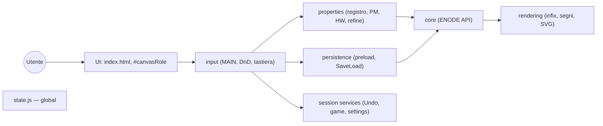
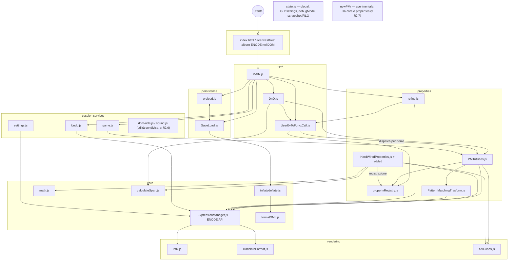
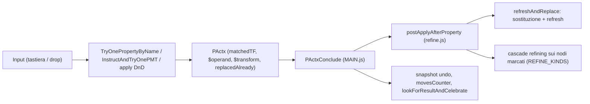

# Aabacus — Moduli software

Specifica dell'organizzazione del codice JavaScript di Aabacus (directory `app/js/`): la divisione dei ruoli tra i moduli, le interfacce con cui interagiscono e i contratti trasversali (PActx, registro delle proprietà, marcature, formati dati). Chi modifica un modulo trova qui che cosa il modulo promette agli altri e da chi è usato.

Documenti correlati: [core-concepts.md](core-concepts.md) (concetti fondamentali), [implementation-details.md](implementation-details.md) (dettagli implementativi), [tests.md](tests.md) (test).

---

## 1. Architettura

Vincoli di fondo, comuni a tutti i moduli:

- **Nessun sistema di moduli**: i file sono caricati con `<script>` in `app/index.html`; ogni funzione e variabile top-level è globale. I riferimenti incrociati si risolvono a tempo di chiamata, quindi l'ordine di caricamento conta solo per il codice eseguito al boot.
- **Il DOM è il modello dati**: l'espressione è un albero di `div[data-enode]` (ENODE) dentro `#canvasRole`. Attributi (`data-enode`, `data-type`, `title`/`mark`, `data-import`) e classi CSS codificano sia semantica sia stato UI. `ENODEextend` copia i metodi dell'oggetto `ENODE` direttamente sui nodi DOM.
- **Due motori di trasformazione**: proprietà *hard-wired* (funzioni JS registrate in `propertyRegistry.js`) e proprietà *pattern-based* (dichiarate come `forAll`+`eq` nel canvas, applicate dal pattern matcher). Entrambe producono un `PActx` e convergono in `PActxConclude` → `refine.js`.

### Strati

Gli script sono organizzati a strati (ordine di caricamento in `index.html`, con `state.js` per primo dopo jQuery). Ogni strato può dipendere solo dagli strati sopra di lui; è vietato introdurre dipendenze verso il basso (es. core che richiama MAIN o settings).

Il diagramma è in due versioni: la **vista sintetica** mostra solo il flusso principale tra strati; la **vista completa** mostra i moduli e le chiamate documentate in §2. In entrambe `state.js` compare come nodo isolato: è stato **globale**, letto e scritto da più strati (dettaglio in §3.5), e disegnarne gli archi renderebbe illeggibile il resto.

#### Vista sintetica

#### Vista completa (senza gli archi di `state.js`)

Regole di dipendenza:

- `core` non conosce UI interattiva (prompt, suoni, snapshot, tool).
- `rendering` legge il core e scrive solo presentazione (classi CSS, `.infix`, SVG).
- `properties` usa `core` + `rendering`; non registra listener.
- `input` (MAIN, DnD, UserEvToFunctCall) è l'unico gruppo che registra eventi document-level e cambia `GLBsettings.tool`.
- `session services` (Undo, game, settings, sound, dom-utils) mantengono stato di sessione o offrono supporto: non gestiscono eventi utente (al più il proprio pannello) e sono invocati da input e persistence. In `index.html` i due gruppi sono caricati insieme nel blocco commentato "interaction".
- Lo stato condiviso residuo è dichiarato e documentato in `state.js` (vedi §3.5).

---

## 2. Ruoli e interfacce dei moduli

Per ogni modulo: il ruolo e le funzioni che costituiscono la sua interfaccia verso gli altri moduli (chiamanti verificati sul codice). Le funzioni non elencate sono helper interni al file. Le proprietà hard-wired sono inoltre invocabili **per nome** dai file dati (`data-tag` / `callfunction` nei `.mml/.mmls`): questo canale passa sempre dal registro (§3.2).

### 2.0 Stato condiviso

#### `state.js`
Ruolo: dichiara le globali condivise intenzionali e ne documenta in testa il contratto (chi scrive, chi legge). Nessuna funzione. Simboli: `GLBsettings` (config esercizio/sessione), `debugMode`, `preloadPath` (da query string `?preloadPath=`, default `PRELOAD.mmls`), `tools` (ciclo tool), `FILO` (stack undo), `ssnapshot` (dichiarato qui, implementato in `Undo.js`). L'header di `state.js` è la fonte autoritativa per campi e accessi.

### 2.1 Core — nucleo espressioni

#### `formatXML.js`
Ruolo: pretty-printer XML puro, senza dipendenze applicative.
Espone:
- `formatXml(xml) → string` — usata da: `inflatedeflate.js`, `SaveLoad.js`.

#### `math.js`
Ruolo: aritmetica di supporto per le proprietà di composizione/scomposizione numerica.
Espone:
- `primeFactorization(num) → fattori[]` — usata da: `HardWiredProperties.js`.
- `separateTensHundreds(n) → [parte, resto]` — usata da: `addedHardWiredProperties.js`.

#### `inflatedeflate.js`
Ruolo: conversione bidirezionale albero ENODE ⇄ MathML; è il confine tra il DOM vivo e i formati di persistenza.
Espone:
- `ENODEcreateMathmlString($startNodes, describeDataType?, neglectRootSign?) → string` (anche come metodo sui nodi) — usata da: `SaveLoad.js`, `MAIN.js`, `ExpressionManager.js` (in `ENODEEqual`).
- `createConvertedTree(startNodeOrMML, from_to, neglectRootSign?, toBeImported?) → jQuery` — usata da: `SaveLoad.js`.
- `$parserForMixedMMLHTML(toBeParsed) → jQuery` — usata da: `SaveLoad.js`, `preload.js`.

#### `ExpressionManager.js`
Ruolo: facciata dell'albero ENODE. È il modulo più esposto: primitive strutturali, navigazione, clonazione da prototipi, sostituzioni, validazione dei drop, valutazione numerica parziale, uguaglianza strutturale, refresh di parentesi/infix. Espone inoltre l'oggetto `ENODE` (metodi copiati sui nodi DOM da `ENODEextend`) e la costante `symbols = ["ci","cn","csymbol"]` (usata da `inflatedeflate.js`, `PatternMatchingTrasform.js`).

Interfaccia, per gruppi (i chiamanti principali sono lo strato properties, `DnD.js`, `MAIN.js`, persistence e `newPM/`):

- Primitive strutturali: `ENODEremove`, `ENODEinsertBefore`, `ENODEinsertAfter`, `ENODEappend`, `ENODEprepend`, `ENODEreplaceNode`, `ENODEswapEqMembers`, `ENODEcreateSymbol`, `identifierToENODE`, `dummyParser`, `getExpressionRootNode` (per `Undo.js`).
- Navigazione e stato: `ENODEparent($n)`, `ENODEtiedDef`, `isDefinition`, `ENODEfrozenDef`, `ENODECreateDefinition`.
- Metodi sui nodi (via oggetto `ENODE`): `ENODE_getRoles(selector)`, `ENODE_getChildren(selector)`, `ENODE_getName(considerSuffix?)`, `ENODE_setName(name)`, `ENODE_addRole(...)`, `ENODE_dissolveContainer()` — usati da quasi tutti gli strati.
- Sostituzione e forAll: `ENODEReplaceLink`, `ENODEReplaceAll`, `GetforAllContentRole`, `GetforAllHeader`, `ENODEForThisPar`, `createForThis`.
- Compatibilità drop: `typeOk($dragged, $role)`, `validTargetsFromOpened($dragged)`, `getNumOfPlaces($role)`, `isTherePlaceForAnother($role)`.
- Clonazione e wrap: `ENODEclone($n, Extend?, removeID?)`, `prototypeSearch(className, dataType?, ...)`, `wrapIfNeeded`, `wrapWithOperation`, `wrapWithDefIfNeededreturnTarget`, `checkSiblings`.
- Valori e confronto: `ENODEsToVal`, `ValToENODEs`, `ENODEgetNameWithSign`, `ENODErename`, `ENODEEqual(n1, n2, checkType?, neglectRootSign?)`, `compareExtENODE($input, $pattern, ...)` (cuore del matching, usata da `PMTutilities.js` e `newPM/match.js`).
- Refresh ed estensione: `RefreshEmptyInfixBraketsGlued($start?, tree?, options?)` (refresh visivo completo, chiamata da quasi tutti gli strati dopo una modifica), `ENODEextend`, `ENODEselectable`, `ENODERefreshAsymmEq`, `ENODEnodesAddClass`, `ENODEapplyFunctToTree`, `getDefaultTool`.

#### `calculateSpan.js`
Ruolo: analisi di scope e giurisdizione logica: span delle variabili legate (`forAll`), occorrenze, propagazione attraverso `and`/`implies`, cluster associativi, evidenziazione delle occorrenze.
Espone:
- `$findOccurrences($wanted, $span, ...) → jQuery` — usata da: `HardWiredProperties.js`, `ExpressionManager.js`, `PMTutilities.js`.
- `$identifierSpanForAll($identifier) → jQuery` — usata da: `HardWiredProperties.js`, `MAIN.js`.
- `highlightOccurrences($identifier, addClass)` — usata da: `DnD.js`.
- `$calculateJurisdictionUpstream($startRole) → jQuery` — usata da: `DnD.js`.
- `$PropositionsAffectedByStartPropositionROLES`, `$calculateTargetsAddRedundantROLES`, `$ImmediateAssociativeENODE`, `$RecursiveTreeExplorerCriterium` — usate da: `HardWiredProperties.js`.

### 2.2 Rendering — refresh visivo

#### `infix.js`
Ruolo: separatori infissi (`.infix`) tra operandi e segnaposto (`.dummyrole`/classe `empty`) per i ruoli con posti liberi.
Espone: `refreshOneInfix($ENODE)`, `refreshOneEmpty($ENODE)` — usate da: `ExpressionManager.js` (dentro `RefreshEmptyInfixBraketsGlued`).

#### `TranslateFormat.js`
Ruolo: trasformazioni di formato del segno (meno come carattere nel nome / classe CSS / operatore) e figli "glued" degli operatori unari.
Espone: `refreshGlued($startNode?)` — usata da: `ExpressionManager.js`. (`ENODEfactorizeMinus` e `signsAsClasses*` sono definite ma oggi senza chiamanti attivi.)

#### `SVGlines.js`
Ruolo: linee SVG di collegamento su `#svgContainer` (hint di match, debug).
Espone: `lineAB($from, $to, addClass?) → jQuery` — usata da: `PMTutilities.js`, `HardWiredProperties.js`, `calculateSpan.js`; `clearLines()` — usata da: `DnD.js`.

### 2.3 Properties — motori di trasformazione

#### `propertyRegistry.js`
Ruolo: registro dei descrittori delle proprietà hard-wired; unico punto di dispatch per nome (sostituisce il vecchio `window[nome]`). Descrittori: `{ name, kind: 'unary'|'dnd', apply, findTgt?, requiresCanvasCi }` (dettagli in §3.2).
Espone:
- `registerHardWired(nameOrDesc, fn?)` — usata da: `HardWiredProperties.js` (registrazione DnD).
- `registerHardWiredMap({nome: fn})` — usata da: `HardWiredProperties.js`, `addedHardWiredProperties.js` (registrazione unary in blocco).
- `getHardWired(name) → apply|undefined` (solo unary) — usata da: `PMTutilities.js` (`TryOnePropertyByName`).
- `listDnDProperties() → descrittori[]` in ordine di registrazione (priorità first-wins) — usata da: `UserEvToFunctCall.js` (`getDnDpropEnabled`).

#### `PMTutilities.js`
Ruolo: runtime delle proprietà: crea il contesto `PActx`, fa il dispatch per nome (HW o pattern-based), orchestra il pattern matching (`InstructAndTryOnePMT` → `adaptMatch`/`orderMatch`), gestisce il sistema di marcature `mark-link-post` e il post-mark verso il refine.
Espone:
- `newPActx() → PActx` — usata da: `HardWiredProperties.js`, `addedHardWiredProperties.js`, `MAIN.js`, `UserEvToFunctCall.js`, `game.js`.
- `TryOnePropertyByName(propName, $par1, firstVal?, justTry?) → PActx` — usata da: `UserEvToFunctCall.js`. Cerca `$('[data-tag=propName]')`: se è un `ci` risolve via `getHardWired`, altrimenti applica la proprietà pattern-based.
- `InstructAndTryOnePMT($origProp, $par1, firstVal?, justTry?) → PActx` — usata da: `DnD.js` (drop su pattern).
- `orderMatch(PActx, order?, ...) → PActx` — usata da: `game.js` (confronto col risultato a meno di riordino).
- `ENODESmarkUnmark($ENODE, value?, attrName?, usePermanentMark?)` — lettura/scrittura marcature — usata da: `ExpressionManager.js`, `HardWiredProperties.js`, `newPM/resolve.js`.
- `searchForMarkedInSubtree($root, mark, ...) → jQuery` — usata da: `DnD.js`.
- `checkMarksOkForPattern($input, $pattern) → boolean` — usata da: `ExpressionManager.js` (dentro `compareExtENODE`).
- `ENODEappendInABSPosition($ENODE, $ref, relativePosition)` — usata da: `ExpressionManager.js`.

#### `PatternMatchingTrasform.js`
Ruolo: lato "transform" del pattern matching: tipi dei parametri (suffissi `_`/`__`/`___`), clone e swap dei membri dell'equazione, sostituzione dei parametri nei `forAll`, riformattazione se restano variabili libere.
Espone:
- `swapMembersClone($origProp, mode) → {foundTF, msg, $cloneProp, visualization}` — usata da: `PMTutilities.js`, `newPM/resolve.js`.
- `replaceInForall($parameter, $newVal, $property)` — usata da: `PMTutilities.js`, `newPM/match.js`.
- `ParameterNameToType(name) → 'x'|'x_'|'x__'|'x___'` — usata da: `PMTutilities.js`, `newPM/match.js`.
- `levelsToAncestor($marked, $patternMember) → number|NaN` — usata da: `PMTutilities.js`, `newPM/resolve.js`.
- `reformatForallProp($prop, $transform)`, `containsBvar($member, $forAll)`, `findPMPropByName(propName)` — usate da: `PMTutilities.js`.
- `parameterInHeader($parameter, $property)` — usata da: `MAIN.js`, `calculateSpan.js`.

#### `HardWiredProperties.js`
Ruolo: implementazioni delle proprietà hard-wired (compose/decompose, associative, distributive, collect, replace, modus ponens, redundant, Hanoi, forThis, ...) e loro registrazione nel registro. Ogni `apply` riceve gli argomenti previsti dal suo `kind` e restituisce un `PActx`.
Interfaccia:
- Registrazione: `registerHardWiredMap({...})` per le unary (es. `compose`, `decomposeInAProduct`, `evaluateComparison`); `registerHardWired({name, kind:'dnd', findTgt, apply, requiresCanvasCi?})` per le DnD (es. `associativeDnD`, `distributiveDnD`, `replaceDnD` con `requiresCanvasCi: false`). L'ordine di registrazione DnD è la priorità di valutazione dei target.
- Funzioni non-proprietà usate da altri moduli: `OpIsAssociative(op)` (→ `ExpressionManager.js`, `calculateSpan.js`), `validCandidatesForPatternDrop($mouseDown, $origProp)` (→ `DnD.js`), `forThisPar_focus_nofocus($val, $par)` (→ `MAIN.js`).

#### `addedHardWiredProperties.js`
Ruolo: specializzazioni didattiche delle proprietà di calcolo (`tabelline`, `composePlusOnly`, `decomposeTens`), registrate come unary via `registerHardWiredMap`; usate dagli esercizi (es. `Crotti.mmls`). Le guardie restituiscono sempre un `newPActx()` fallito quando le precondizioni non valgono. Chiama `compose` del file principale.

#### `refine.js`
Ruolo: post-applicazione di una proprietà: sostituzione operando → transform, refresh visivo, e *cascade refining* tipizzato sui nodi marcati (`REFINE_KINDS`, oggi solo `'c'` = simplify), con limite `REFINE_MAX_STEPS` e warn anti-loop.
Espone:
- `postApplyAfterProperty(PActx) → PActx` — usata da: `MAIN.js` (`PActxConclude`). Fa `refreshAndReplace` + `refineAfterProperty`.
- `markNeedsRefine($nodes, kind='c')` — usata da: `HardWiredProperties.js`, `PMTutilities.js` (post-mark `p:c`).
- `clearRefineMarkers($root?)` — usata da: `DnD.js`.
- `refreshAndReplace(PActx) → PActx` — usata da: `newPM/api.js`.
- Costante `REFINE_KINDS` — letta da `PMTutilities.js`.

### 2.4 Persistence — caricamento e salvataggio

#### `SaveLoad.js`
Ruolo: persistenza locale: download/upload file, primitiva di iniezione MML nel DOM, risoluzione degli import, serializzazione della sessione.
Espone:
- `inject(MMLstring, $targetRoleOrENODE, containerRequirements?, toBeImported?)` — usata da: `preload.js`, `newPM/demo-fixtures.js`.
- `importAll($startNode?)` — risolve i `[data-import]` — usata da: `preload.js`.
- `AlltoMMLSstring() → string` — serializza palette/canvas/events/result (**non** i settings: il commento `//save settings` nel corpo è senza codice, v. TODO) — usata da: `MAIN.js` (Shift+S).
- `saveTextAsFile(text, fileName)`, `loadFileConvert(fileToLoadPar, $targetNode?, fileSuffix?)` — usate da: `MAIN.js`.

#### `preload.js`
Ruolo: bootstrap dei contenuti via AJAX: scarica il `.mmls` e ne inietta le sezioni (palette prima del canvas, perché l'inflate usa i prototipi della palette), popola `GLBsettings` dalla sezione settings.
Espone:
- `preloadAll(myUrl)` — usata da: `MAIN.js` (boot).
- `injectAllMMLS(response, rootUrl?)` — usata da: `SaveLoad.js` (upload `.mmls`).
- `injectAll(response, rootUrl?)` — loader legacy JSON — usata da: `SaveLoad.js`.
- `loadAjaxAndInject(myUrl, target?, toBeImported?)` — GET sincrona + inject — usata da: `SaveLoad.js` (`importAll`).

### 2.5 Input — gestione degli eventi utente

I tre moduli che traducono le azioni dell'utente in chiamate agli strati superiori. Sono gli unici a registrare listener document-level.

#### `MAIN.js`
Ruolo: orchestratore e hub eventi. Registra i listener document-level (click, dblclick, mousedown/touchstart → DnD, mouseup/touchend → cleanup, keydown → scorciatoie e `keyboardEvToFC`), avvia il boot, gestisce tool e debug, conclude ogni applicazione di proprietà.
Espone:
- `PActxConclude(PActx)` — usata da: `DnD.js` (e internamente dopo la tastiera). Punto di convergenza di *tutte* le proprietà: delega a `postApplyAfterProperty` (replace + cascade refining), aggiorna `movesCounter`, prende lo snapshot undo, chiama `lookForResultAndCelebrate` e la visualizzazione del feedback.
- `selectionManager($clicked, ctrl, shift, deselectAll)` — usata da: `DnD.js`.
- `ExtendAndInitializeTree($start)` / `ExtendAndInitialize($ENODE)` — usate da: `SaveLoad.js`, `Undo.js`, `ExpressionManager.js`.
- `VisualizeCelebration(imagePath, timeout?)` — usata da: `game.js`.
- Globale `canvasRole` — usata da: `UserEvToFunctCall.js`.

#### `DnD.js`
Ruolo: motore drag & drop su SortableJS: al mousedown individua il nodo trascinabile e i target validi (riordino su untied, proprietà DnD dal registro, autoAdapt, copy), crea pigramente i Sortable, gestisce il drop e la pulizia. Stato interno nel bus `GLBDnD` (usato solo da questo file).
Espone:
- `MakeSortableAndInjectMouseDown(event)` — usata da: `MAIN.js` (mousedown/touchstart). Fa anche la selezione (via `selectionManager`).
- `MouseUpCleanup(event)` — usata da: `MAIN.js` (mouseup/touchend).
- `cleanupDnD()` — usata da: `MAIN.js` (prima delle proprietà da tastiera).

#### `UserEvToFunctCall.js`
Ruolo: traduzione input → proprietà: mappa i tasti sulle ricette della sezione `#events` e calcola quali proprietà DnD sono abilitate.
Espone:
- `keyboardEvToFC($ENODE, keyPressed, event?)` — usata da: `MAIN.js` (keydown).
- `tryEventActionsOnNode($ENODE, eventKey) → PActx` — usata da: `refine.js` (cascade refining).
- `getDnDpropEnabled(dataTag?) → descrittori[]` — usata da: `DnD.js`. Legge `listDnDProperties()` e filtra per `requiresCanvasCi`/presenza del `ci` in canvas.

### 2.6 Session services — stato e servizi di sessione

Servizi con memoria o funzioni di supporto: non gestiscono eventi utente (al più ascoltano il proprio pannello), ma sono invocati dagli strati input e persistence. In `index.html` sono caricati nello stesso blocco dello strato input.

#### `Undo.js`
Ruolo: undo a snapshot: stack `FILO` di cloni dell'albero radice; lo snapshot è preso *dopo* ogni azione. La *politica* (quando fotografare) è dei chiamanti; qui c'è solo il meccanismo.
Espone: `ssnapshot()` (init) e i metodi `ssnapshot.take/undo/copy/paste` — usati da: `MAIN.js`, `SaveLoad.js`, `TranslateFormat.js`.

#### `game.js`
Ruolo: confronto dell'espressione nel canvas con `#result` e celebrazione della vittoria (conteggio mosse incluso).
Espone: `lookForResultAndCelebrate(movesCounter, movesMinNumber)` — usata da: `MAIN.js`, `DnD.js`. Usa `orderMatch` per il confronto a meno di riordino e `VisualizeCelebration` di `MAIN.js`.

#### `settings.js`
Ruolo: ponte bidirezionale tra `GLBsettings` e il pannello `#settings` (classi/attributi sul `body` per il CSS).
Espone: `GLBsettingsToInterface()` — usata da: `preload.js` (dopo il parsing della sezione settings). Registra il listener `change` su `#settings`.

#### `sound.js`
Ruolo: precarica gli oggetti Audio. Espone le globali `clickSound` (→ `DnD.js`) e `victorySound` (→ `game.js`).

#### `dom-utils.js`
Ruolo: utilità DOM/stringhe senza logica di esercizio.
Espone: `removeClassStartNodeAndDiscendence` (→ `PMTutilities.js`, `ExpressionManager.js`), `removeClassByPrefix` (→ `DnD.js`), `commonParent` (→ `DnD.js`, `HardWiredProperties.js`), `wrapUnwrapUrlString` (→ `inflatedeflate.js`, `DnD.js`, `PatternMatchingTrasform.js`), `buildPath` (→ `preload.js`), `writeData` (→ `inflatedeflate.js`), `getCol` (→ `ExpressionManager.js`), `CriterionParentSon` (→ `DnD.js`).

### 2.7 newPM/ — motore PM sperimentale

Ruolo: reimplementazione sperimentale del pattern matching con match tracciato, bind eager (`replaceInForall` a ogni bind) e storyboard visuale. Caricato in `index.html` ma **non** sostituisce il PM di produzione: si invoca da console con `newPM(selectorDragged, selectorTarget, options?)` (contratto allineato ad autoAdapt). File: `match.js` (matcher), `resolve.js` (dragged+target → forAll/direzione/clone), `phases.js` (script visuale), `visualize.js` (player), `api.js` (facciata `newPM`), `load.js` (loader console-only, non in `index.html`).

Dipende dalle interfacce di produzione: `compareExtENODE`, `replaceInForall`, `swapMembersClone`, `levelsToAncestor`, `ENODESmarkUnmark`, `ENODEclone`/`ENODEextend`/`ENODEremove`, `refreshAndReplace`, `RefreshEmptyInfixBraketsGlued`. Dettagli, fixture e API in [app/js/newPM/README.md](../../app/js/newPM/README.md).

---

## 3. Contratti trasversali

### 3.1 PActx — ciclo di vita di una proprietà

`PActx` (creato da `newPActx()` in `PMTutilities.js`) è il contratto tra chi applica una proprietà e chi ne conclude gli effetti. Campi principali: `matchedTF` (successo), `msg`, `$pattern`, `$operand`, `$transform` (radice del risultato), `$equation`, `$cloneProp`, `replacedAlready`, `visualization`.

Convenzioni:

- Le proprietà hard-wired di solito modificano il DOM direttamente e impostano `replacedAlready = true`; le pattern-based lasciano la sostituzione `$operand` → `$transform` a `refreshAndReplace`.
- Una proprietà fallita restituisce comunque un `PActx` (con `matchedTF` falso), mai `undefined`.

### 3.2 Registro delle proprietà hard-wired

`propertyRegistry.js` è l'unico canale di dispatch per nome. Descrittore:

- `kind: 'unary'` — invocata da tastiera/`#events`: `apply($ENODE, firstVal?, img?)`.
- `kind: 'dnd'` — invocata dal drag & drop: `findTgt($mouseDownENODE, ...) → target validi`, `apply(dragged, target, dropped?)`. L'ordine di registrazione è la priorità (first-wins in `DnD.js`).
- `requiresCanvasCi` — se `true` (default) la proprietà è attiva solo se in canvas esiste un `ci[data-tag=nome]` (il canvas resta il gate didattico); se `false` la proprietà è fondazionale, sempre attiva (es. `replaceDnD`).

Percorsi **strutturali** che non passano dal registro (sempre attivi): riordino commutativo (Sortable con `sort=true` nei ruoli untied o `data-commutative`), creazione di una nuova definizione (drop su target `opened` / `wrapWithDefIfNeededreturnTarget`, Ctrl+B `ENODECreateDefinition`).

### 3.3 Marcature e cascade refining

- Le marcature vivono nella stringa `mark-link-post` in `title` (persistente, salvata in MML) o `mark` (volatile), lette/scritte da `ENODESmarkUnmark`. `m` = vincoli di match (es. `s` selected, `d` dragged), `l` = etichette per i path di riordino, `p` = post-azioni.
- Post-azione `p:c` → `markNeedsRefine($nodo, 'c')`: dopo l'applicazione, `refine.js` esegue il *cascade refining*: per ogni kind in `REFINE_KINDS` applica iterativamente la ricetta evento corrispondente (`tryEventActionsOnNode`) ai nodi marcati, finché non ci sono più match o si raggiunge `REFINE_MAX_STEPS` (warn in console se il limite tronca il processo). `p:n` = non riordinare (non riusare `n` per altri scopi).

### 3.4 Formati dati e pipeline di boot

Formati in `app/Data/`: `.mmls` = bundle multi-sezione (palette/events/canvas/result/settings, sessione completa), `.mml` = frammento MathML (fondamenti, eventi, esercizi), `.prt` = prototipi palette in HTML, `.set` = impostazioni JSON, `.json` = manifest legacy per `injectAll`. L'attributo `data-import` su un ENODE segnaposto fa caricare e iniettare un file esterno (`importAll`); al salvataggio i figli importati vengono scartati e resta il riferimento.

Boot: `state.js` legge `preloadPath` dalla query string → `MAIN.js` chiama `preloadAll` → `injectAllMMLS` → `inject` per ogni sezione (palette prima del canvas) → `importAll` → parsing settings in `GLBsettings` → `GLBsettingsToInterface` → `RefreshEmptyInfixBraketsGlued`.

I file dati partecipano al dispatch: gli `eventtoaction` in `#events` e i `data-tag`/`callfunction` negli esercizi invocano le proprietà **per nome**; ogni rinomina di proprietà va quindi verificata anche in `app/Data/`.

### 3.5 Stato globale condiviso

Le globali intenzionali sono dichiarate e documentate in [app/js/state.js](../../app/js/state.js) (`GLBsettings`, `debugMode`, `preloadPath`, `tools`, `FILO`, `ssnapshot`). Fuori da `state.js` restano: `ENODE` e `symbols` (`ExpressionManager.js`), il registro HW (`propertyRegistry.js`), `GLBDnD` (bus interno a `DnD.js`), `clickSound`/`victorySound` (`sound.js`), `canvasRole` (`MAIN.js`), il namespace `NewPM`/`newPM`. Il DOM stesso fa da contenitore di stato (attributo `body[tool]`, classi `.selected`/`.untied`/`mu_*`, attributi `target`/`from`/`mark`).

---

## 4. TODO

Cosa resta da fare, verificato sul codice attuale (la storia della rifattorizzazione 2025-26 — bonifica codice morto, bug latenti, globali implicite, estrazione UI dal core, `state.js`, ordine a strati — è ricostruibile dai commit e non è più tracciata qui):

1. **Moduli veri** (ex passo 8): avvolgere i file in IIFE con namespace (`Aabacus.core`, ...) o migrare a ES modules. Il prerequisito (registro esplicito al posto di `window[nome]`) è soddisfatto da `propertyRegistry.js`; resta da chiudere lo scope globale strato per strato.
2. **`importAll` (`SaveLoad.js`)**: ignora il parametro `$startNode` (cerca sempre in `body`) ed è a passata singola: import annidati in file appena caricati possono restare irrisolti.
3. **`loadFileConvert` (`SaveLoad.js`)**: ignora il parametro `fileToLoadPar` e legge sempre `#fileToLoad`.
4. **`ENODEModusPonens` (`HardWiredProperties.js`)**: incompleto (il wrap in `and` della premessa è solo un commento) ma registrato come `modusPonensDnD`.
5. **`newPM/`**: decidere il percorso di integrazione o sostituzione rispetto al PM di produzione (`PMTutilities.js` + `PatternMatchingTrasform.js`); finché convivono, ogni modifica alle interfacce elencate in §2.7 va verificata su entrambi.
6. **Funzioni definite senza chiamanti attivi** (candidate a rimozione o a completamento): `ENODEfactorizeMinus`, `signsAsClasses`/`signsAsClassesSubtree` (`TranslateFormat.js`), `ENODENumericCdsAsText` (`math.js`), `getHardWiredEntry`/`listHardWiredPropertyNames` (`propertyRegistry.js`), `searchForProperty` (`UserEvToFunctCall.js`, l'unico uso in `HardWiredProperties.js` è in un blocco commentato).
7. **`AlltoMMLSstring` (`SaveLoad.js`) non serializza i settings**: il salvataggio Shift+S produce un `.mmls` senza sezione settings (il commento `//save settings` è un TODO senza codice); al ricaricamento l'esercizio perde le impostazioni (tool, gameMode, ...).
8. **`ENODE_dissolveContainer` (`ExpressionManager.js`, bug latente)**: il `return $children` finale riferisce una `const` dichiarata dentro il ramo `if` → `ReferenceError` a ogni chiamata. Oggi non scatta solo perché i due chiamanti (`ENODEfactorizeMinus`, `signsAsClasses` in `TranslateFormat.js`) sono a loro volta senza chiamanti attivi (voce 6). Da correggere prima di riattivare quei percorsi.

### Criteri di verifica per ogni modifica strutturale

- Suite Playwright (`npx playwright test` in `project/tests`) verde.
- `node smoke-expression-manager.js` verde.
- Caricamento manuale di almeno: `PRELOAD.mmls` (default), `hanoi4.mmls`, un esercizio con `decomposeTens`/`tabelline` (es. Crotti), salvataggio e ricaricamento con Shift+S / Shift+L.
- Nessun errore in console al boot e durante le operazioni di base.
