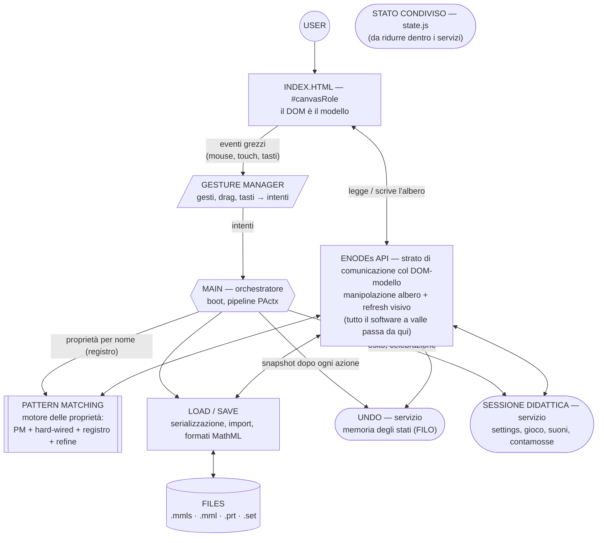

# Aabacus — Architettura target (progetto post-refactoring)

**Stato: BOZZA in attesa di revisione e approvazione di Romualdo.** Livello 2 (architettura); le scelte marcate "da decidere" sono di Romualdo.

**Rapporto con gli altri documenti:** [`software-modules.md`](software-modules.md) descrive lo **stato attuale** del software (moduli, interfacce, risalite note); questo documento descrive il **progetto**: quali dovranno essere i macro-moduli, il loro ruolo e il loro tipo dopo il refactoring. La mappa di migrazione (§4) collega i due. Origine: schizzo a mano di Romualdo (ago 2026) — USER, INDEX.HTML, ENODEs API, GESTURE MANAGER, MAIN, PATTERN MATCHING, LOAD/SAVE, UNDO, FILES — qui completato con le parti mancanti, marcate come *aggiunte proposte*.

---

## 1. Tassonomia: tipi di modulo

Non tutti i moduli sono della stessa natura. Il progetto distingue cinque tipi; ogni macro-modulo dichiara il suo.

| Tipo | Natura | Memoria tra le chiamate | Esempio canonico |
|------|--------|--------------------------|------------------|
| **Orchestratore** | coordina il flusso, non contiene logica di dominio | no (solo il filo del flusso) | MAIN |
| **Gestore di eventi** | traduce eventi grezzi (mouse, touch, tasti) in *intenti* | solo lo stato del gesto in corso | GESTURE MANAGER |
| **Libreria / API** | funzioni pure o quasi: ogni operazione è **una chiamata**, senza memoria propria | no | ENODEs API, LOAD/SAVE |
| **Motore** | libreria con algoritmi complessi e contratti ricchi (PActx) | no (il contesto viaggia nel PActx) | PATTERN MATCHING |
| **Servizio** | mantiene **memoria di stati** per tutta la sessione; ha un ciclo di vita | sì (è la sua ragion d'essere) | UNDO, SESSIONE DIDATTICA |

La distinzione chiave richiesta dal progetto: **UNDO è un servizio** (custodisce la memoria degli stati precedenti, stack FILO, vive quanto la sessione), mentre **LOAD/SAVE è una libreria** (serializzare o caricare è una chiamata di funzione che finisce lì: nessuna memoria tra un salvataggio e l'altro).

## 2. Schema dei macro-moduli

Legenda forme: esagono = orchestratore; parallelogramma = gestore di eventi; rettangolo = libreria/API; doppio bordo = motore; ovale = servizio; cilindro = risorsa esterna.

Flusso tipico di un'azione: l'utente agisce sulla UI → il GESTURE MANAGER riceve gli eventi grezzi, riconosce il gesto e produce un intento → MAIN lo instrada al motore (dispatch per nome via registro) → il motore calcola la trasformazione e la applica passando dallo strato ENODEs API → MAIN conclude (PActx): chiede lo snapshot a UNDO e l'esito alla SESSIONE DIDATTICA. ENODEs API sta in alto, subito sotto `index.html`, perché è lo **strato di comunicazione** tra il DOM-modello e tutto il software a valle: nessun modulo tocca l'albero senza passarci.

## 3. Ruolo e contratto di ogni macro-modulo

### 3.1 UI (`index.html`, `#canvasRole`)
Il DOM resta il modello (invariante confermata). Nessuno script inline; ancoraggi stabili (`#canvasRole`, `#palette`, `#events`, `#result`, `#settings`). **Nessun modulo tocca il DOM-modello direttamente: solo tramite ENODEs API.**

### 3.2 ENODEs API — libreria (facciata)
Manipolazione dell'albero ENODE (struttura, navigazione, clone, confronto, valutazione) **e** refresh visivo (infix, glued, parentesi, SVG): finché il DOM è il modello, tenere l'albero "presentabile" è parte del contratto della facciata. Include le utilità pure (dom-utils, math) e — proposta — le **marcature** (`ENODESmarkUnmark`: sono attributi dell'albero, oggi nel PM) e la **conoscenza degli operatori** (`OpIsAssociative`, oggi nelle proprietà hard-wired): così si sana la risalita n. 3 di `software-modules.md` §1 (core → properties). Non conosce: prompt, suoni, snapshot, tool, file.

### 3.3 GESTURE MANAGER — gestore di eventi
Unico registratore di listener document-level. Traduce mouse/touch/tastiera in **intenti** tramite la tabella gesto→azione (v. `new-interface-spec.md` §7.5, già prototipata in `input2/`): riconoscimento (slice, lazo, drag, pinch, tasti) separato dal dispatch. Non applica proprietà: consegna intenti a MAIN. Stato ammesso: solo il gesto in corso.

### 3.4 MAIN — orchestratore
Dimagrisce: boot (delega a LOAD/SAVE) e pipeline di conclusione (PActx → post-apply → snapshot UNDO → esito SESSIONE). Ciò che oggi lo gonfia trasloca: listener → GESTURE MANAGER; `ExtendAndInitialize*` → ENODEs API; `VisualizeCelebration` → SESSIONE. Delle quattro *risalite* censite in `software-modules.md` §1, qui si sanano le nn. 2 e 4 (quelle verso MAIN); la n. 1 si sana nel motore (§3.5), la n. 3 nell'ENODEs API (§3.2).

### 3.5 PATTERN MATCHING — motore delle proprietà
Tutta la trasformazione: pattern matching (`forAll`+`eq`), proprietà hard-wired, **registro** (unico dispatch per nome), refine/cascade. Contratto d'ingresso/uscita: PActx. Legge da sé le ricette `#events` dell'esercizio (oggi risale al layer input: da sanare). `newPM/` è il candidato sostituto del matcher (decisione FUTURIBILE, roadmap §2.4).

### 3.6 LOAD / SAVE — libreria
Chiamate senza memoria: carica/salva sessioni `.mmls`, risolve import, converte ENODE ⇄ MathML (proposta: `inflatedeflate` + `formatXML` si spostano qui — la conversione serve solo alla persistenza; oggi stanno nel core). Unico modulo che tocca FILES.

### 3.7 UNDO — servizio
Custodisce la **memoria degli stati precedenti** (stack FILO di snapshot; copy/paste). Ciclo di vita = sessione. La *politica* (quando fotografare) resta dell'orchestratore; il servizio offre il meccanismo. Non parla con FILES né con l'utente.

### 3.8 SESSIONE DIDATTICA — servizio (aggiunta proposta, non nello schizzo)
Stato della sessione d'esercizio: impostazioni (`GLBsettings` + pannello), modalità gioco (confronto col risultato, contamosse, celebrazione, suoni). Assorbe `settings.js`, `game.js`, `sound.js` e gran parte di `state.js`.

### 3.9 FILES — risorsa esterna
`app/Data/**` (`.mmls`, `.mml`, `.prt`, `.set`), download/upload del browser. Nessuna logica.

## 4. Mappa di migrazione (file attuali → macro-moduli target)

| Macro-modulo target | Tipo | File attuali (`app/js/`) |
|---------------------|------|--------------------------|
| ENODEs API | libreria | `ExpressionManager.js`, `calculateSpan.js`, `math.js`, `dom-utils.js`, `infix.js`, `TranslateFormat.js`, `SVGlines.js` (+ `ENODESmarkUnmark` da `PMTutilities.js`) |
| GESTURE MANAGER | gestore eventi | `DnD.js`, `UserEvToFunctCall.js`, listener di `MAIN.js`; prototipo target: `input2/gestures.js` + `input2/intentMap.js` |
| MAIN | orchestratore | `MAIN.js` ridotto (boot + `PActxConclude`); prototipo del boot target: `input2/boot2.js` |
| PATTERN MATCHING | motore | `PMTutilities.js`, `PatternMatchingTrasform.js`, `HardWiredProperties.js`, `addedHardWiredProperties.js`, `propertyRegistry.js`, `refine.js` (candidato: `newPM/`) |
| LOAD / SAVE | libreria | `SaveLoad.js`, `preload.js` (proposta: + `inflatedeflate.js`, `formatXML.js`) |
| UNDO | servizio | `Undo.js` |
| SESSIONE DIDATTICA | servizio | `settings.js`, `game.js`, `sound.js` |
| STATO CONDIVISO (transitorio) | — | `state.js`, da riassorbire: `GLBsettings` → SESSIONE; `FILO` → UNDO; `preloadPath` → LOAD/SAVE; `tools`/`debugMode` → MAIN/GESTURE MANAGER |
| UI | modello DOM | `index.html` (rapporto con `index2.html`: da decidere, v. §5) |
| FILES | risorsa esterna | `app/Data/**` |

Nota: `MAIN.js` compare in due righe perché è un **file da spezzare** (listener al GESTURE MANAGER, orchestrazione al MAIN target).

## 5. Decisioni da prendere (Romualdo)

1. **Collocazione della conversione MathML**: `inflatedeflate`+`formatXML` sotto LOAD/SAVE (proposta) o dentro ENODEs API (stato attuale)?
2. **Refresh visivo**: confermare la proposta della bozza (dentro ENODEs API: il DOM-modello va tenuto presentabile dalla facciata, ed è così che il diagramma §2 lo disegna) oppure separare un macro-modulo "Rendering"?
3. **Marcature** (`mark-link-post`): scendono in ENODEs API (proposta) o restano nel motore?
4. **Fronte unico**: il GESTURE MANAGER target è l'evoluzione di `input2/` (FrontEnd2). Quando i due fronti convergono, `index.html`+`index2.html` diventano uno solo?
5. **`newPM/`**: sostituisce il matcher di produzione dentro PATTERN MATCHING? (roadmap §2.4, FUTURIBILE)
6. **Servizi a eventi**: UNDO e SESSIONE restano *chiamati* da MAIN (proposta: semplice, com'è oggi) o si agganciano a un punto di pubblicazione ("proprietà applicata")?

## 6. Percorso (dopo l'approvazione)

I moduli IIFE + namespace attuali sono il punto di partenza: la migrazione è per lo più **spostare funzioni tra namespace**, un macro-modulo alla volta, con i criteri di verifica di sempre (roadmap §3). Ordine suggerito: prima le risalite — verso MAIN (§3.4: `ExtendAndInitialize*`, celebrazione), verso il layer input (§3.5: lettura ricette `#events`), verso il motore (§3.2: marcature e associatività) — poi le ricollocazioni decise in §5, infine il GESTURE MANAGER unificato — che è il cantiere condiviso col fronte FrontEnd2.
